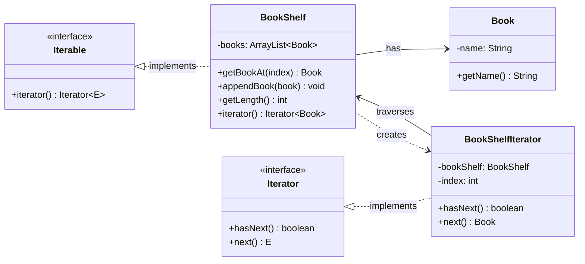
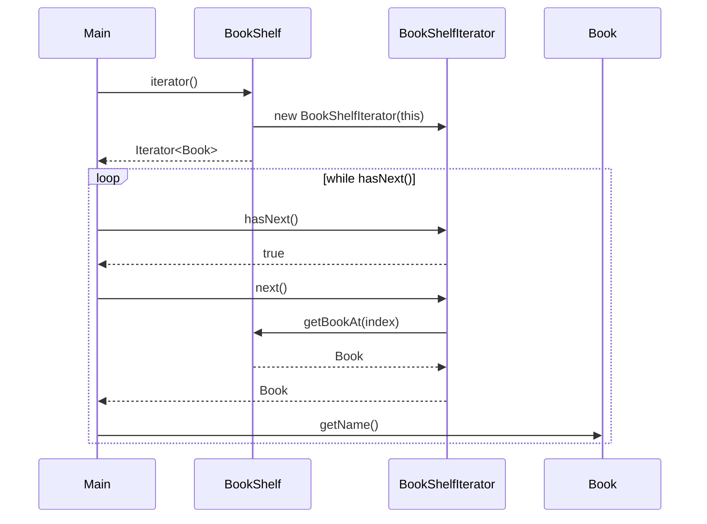

# Iterator パターン まとめ

## 概要

for文の変数 `i` の動きを抽象化し、コレクションの内部構造を隠蔽しつつ要素を順番に走査するパターン。

## クラス図



## 処理の流れ



## 登場する役割

| 役割 | サンプルでの実装 | 責務 |
|------|-----------------|------|
| Iterable (集合体) | `BookShelf` | イテレータを生成するインターフェース |
| Iterator (反復子) | `BookShelfIterator` | `hasNext()` / `next()` で要素を順に返す |
| ConcreteAggregate | `BookShelf` | 具体的なコレクション。内部で `ArrayList<Book>` を保持 |
| ConcreteIterator | `BookShelfIterator` | `BookShelf` の走査方法を実装。`BookShelf` と対の存在 |
| Element | `Book` | コレクションに格納される要素 |

## 何が嬉しいか

### 利用側が実装に依存しない

Iterator を使う側（`Main`）は `hasNext()` / `next()` しか呼ばないため、`BookShelf` の内部実装が変わっても影響を受けない。

```java
// この利用側コードは、BookShelfの内部が配列でもArrayListでも変わらない
Iterator<Book> iter = bookShelf.iterator();
while (iter.hasNext()) {
    Book book = iter.next();
    System.out.println(book.getName());
}
```

### 変更範囲の集約

実装に依存している箇所を抽象化し、変更範囲を一箇所（`BookShelfIterator`）に集約する。

- 変更作業自体はどこかで必ず発生する（ゼロにはならない）
- ただし修正箇所が1箇所に集約されることで、**変更のコスト**は大幅に減る：
  - 修正漏れのリスクが減る（10箇所直すより1箇所の方が安全）
  - テスト範囲が限定される
  - 影響範囲の調査コストが減る

### 具体例：配列 → ArrayList への変更

メモ上のサンプルコードは `Book[]`（配列）で実装されているが、sandbox の実装は `ArrayList<Book>` に変更済み。この変更で `Main.java` 側のコードは一切変わっていない。これがまさに Iterator パターンの恩恵。

## 抽象クラス・インターフェースの効果

具体的なクラス（`BookShelf`）ではなく抽象的なインターフェース（`Iterable`, `Iterator`）に依存することで：

- クラス間の結合が弱まる
- 部品として再利用しやすくなる
- 内部実装の変更が外部に波及しにくくなる

## 他の言語との比較

### C++

C++ の STL にもイテレータがあるが、設計思想が異なる。

| | Java | C++ |
|--|------|-----|
| 取得方法 | `collection.iterator()` | `container.begin()` / `container.end()` |
| 進め方 | `iter.next()` (値を返しつつ進む) | `++it` (進める) + `*it` (値を取得) |
| 終了判定 | `iter.hasNext()` | `it != container.end()` |
| 設計思想 | メソッド呼び出しベース | ポインタに近い設計 |

### Ruby

Ruby では Iterator パターンが**言語レベルで組み込まれている**ため、`hasNext()` / `next()` のようなクラスを自作する必要がない。`each` メソッドを定義するだけで済む。

```ruby
class BookShelf
  include Enumerable  # each を定義すれば map, select, find 等が全部使える

  def initialize
    @books = []
  end

  def append(book)
    @books << book
  end

  def each(&block)
    @books.each(&block)
  end
end

shelf = BookShelf.new
shelf.append("test1")
shelf.append("test2")
shelf.each { |book| puts book }
```

| | Java | Ruby |
|--|------|------|
| 仕組み | `Iterator` インターフェースを実装したクラスを作る | `each` メソッド + ブロックを定義する |
| 走査の状態管理 | `BookShelfIterator` が `index` を自分で管理 | ブロックに要素が渡されるので不要 |
| 拡張 | 自前で実装 | `Enumerable` を include すれば `map`, `select`, `find` 等が自動で使える |

## デザインパターンとフレームワークの関係

### フレームワーク（Rails等）が吸収しているパターン

多くのデザインパターンはフレームワーク内部で使われており、開発者は意識せずに恩恵を受けている。

| パターン | Railsでの例 | 開発者が意識するか |
|--|--|--|
| Iterator | `each`, `Enumerable`（Ruby言語側） | しない |
| Observer | `after_save` 等のコールバック | パターン名は意識しない |
| Template Method | コントローラの `before_action` 等 | パターン名は意識しない |
| ActiveRecord | `User.find`, `user.save` | パターン名は知らなくても使える |
| MVC | コントローラ/モデル/ビューの分離 | Railsのルールとして意識する |

### 規模が大きくなると意識が必要になるパターン

Railsの「レールに乗っている」範囲では意識しなくて済むが、アプリケーションが複雑になると自分でパターンを適用する場面が出てくる。

- **Service Object** - コントローラやモデルが肥大化したとき
- **Decorator / Presenter** - ビューのロジックが複雑になったとき
- **Strategy** - 支払い方法など、処理を切り替えたいとき
- **Facade** - 外部API連携をまとめたいとき

### まとめ

- GoFのデザインパターンには「言語機能が貧弱だった時代に、言語が提供しない機能を設計で補ったもの」が含まれている（Iteratorパターンが典型例）
- RubyやRailsのように言語・フレームワークが強力な場合、パターンを意識せずとも自然に使えることが多い
- ただし学んでおく価値はある：「なぜフレームワークがこう設計されているか」の理解が深まり、複雑な設計が必要になったときの引き出しになる
